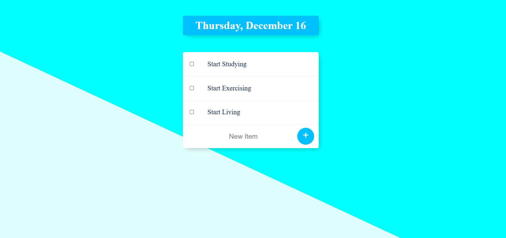

Incorporating the knowledge of Node.Js that encompasses concepts of Nodemon, Routers, APIs, and HTTP requests, this project is a To-Do Daily Task application that allows users to document each important task of the day. Through this project, I was able to understand how Javascript is extensively utilized in backend server, and creating a central database can store data and communicate with the frontend application.

